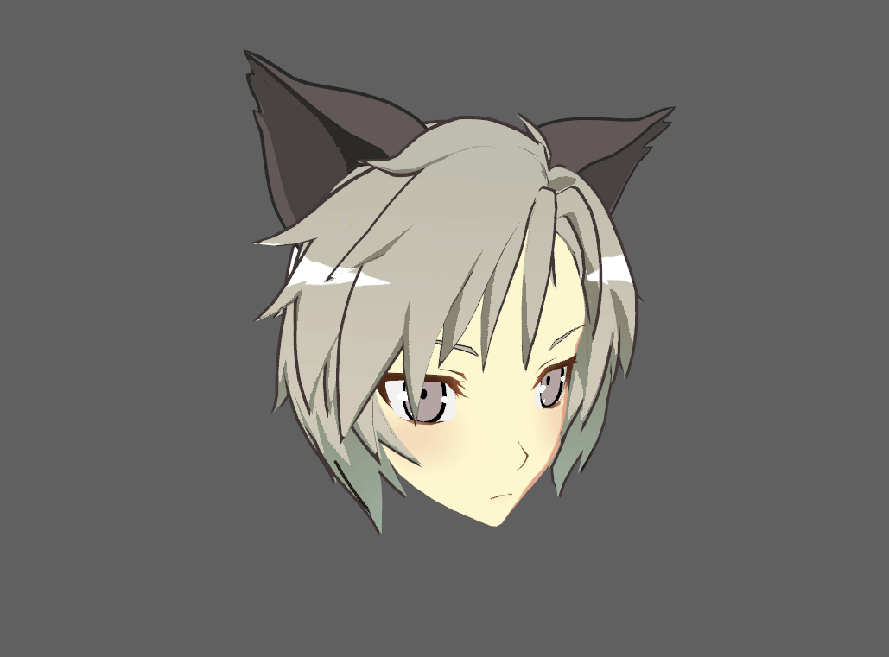

# Angel Ring Projection Settings

The Angel Ring effect for UTS expresses shine or luster in hair. This effect always appears in a fixed position as seen from the Camera. Angel Ring requires the 2nd UV in the meshes.

- [Angel Ring Projection](#angel-ring-projection) 
  - [Angel Ring](#angel-ring)
  - [Offset U](#offset-u)
  - [Offset V](#offset-v)
  - [Alpha Channel as Clipping Mask](#alpha-channel-as-clipping-mask)

## Angel Ring Projection
Enable the Angel Ring effect for UTS, which expresses shine or luster in hair.

### Angel Ring 
Angel Ring : Texture(sRGB) × Color(RGB). Default:Black.
By default, the **Unity Toon Shader** adds the color to the lighting results. Texture alpha channel doesn't affect.
Please refer to [Alpha Channel as Clipping Mask](#alpha-chennel-as-clipping-mask) when alpha clipping is desirable.

 
Angel Ring Texture Example

### Offset U
Adjusts the Angel Ring’s shape in the horizontal direction. The range is from 0.0 to 0.5. The default is 0.
please refer to the image in [Offset V](#offset-v).

### Offset V
Adjusts the Angel Ring’s shape in the vertical direction. The range is from 0.0 to 1.0. The default is 0.3.

<video title="The head of a chibi-style character, oriented face-on. The v-shaped highlights in the hair grow and shrink vertically, and move up and down." src="images/AngelRingOffsetUV_1.mp4" width="auto" height="auto" autoplay="true" loop="true" controls></video>

### Alpha Channel as Clipping Mask

Texture alpha channel is a clipping mask. If disabled, the alpha doesn't affect at all. The color of the **Angel Ring** can directly affects instead of using the additive method.

 
Example texture.

 
Applied the texture with **Alpha Channel as Clipping Mask**.
