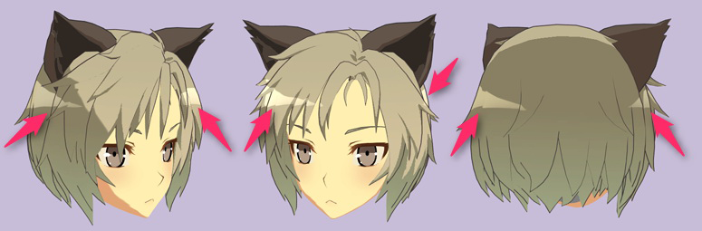
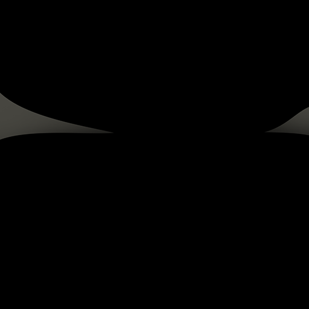
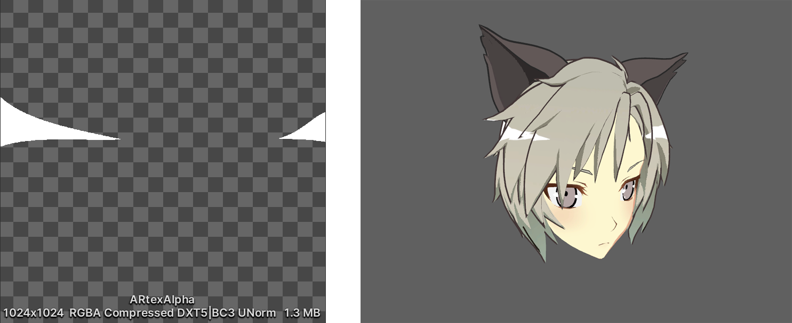

# Angel Ring Projection Settings

The Angel Ring effect for UTS expresses shine or luster in hair. 
This effect always appears in a fixed position as seen from the camera.

Angel Ring requires:
1. [Unity Toon Shader mode](Modes.md) set to **With Additional Control Maps**.
2. 2nd UV in the model.

- [Angel Ring Projection](#angel-ring-projection)
  - [Angel Ring](#angel-ring)
  - [Offset U and V](#offset-u-and-v)
  - [Alpha Channel as Clipping Mask](#alpha-channel-as-clipping-mask)

## Angel Ring Projection
Enable the Angel Ring effect for UTS, which expresses shine or luster in hair.

### Angel Ring
Angel Ring: Texture(sRGB) × Color(RGB). Default: Black.

**Unity Toon Shader** adds the color to the lighting results, and 
you can also clip the effect using the alpha of the texture.
See [Alpha Channel as Clipping Mask](#alpha-channel-as-clipping-mask) for details.

 
Angel Ring Texture Example

### Offset U and V

* Offset U: Adjusts the Angel Ring's shape in the horizontal direction.
* Offset V: Adjusts the Angel Ring’s shape in the vertical direction.

<video title="The head of a chibi-style character, oriented face-on. The v-shaped highlights in the hair grow and shrink vertically, and move up and down." src="images/AngelRingOffsetUV_1.mp4" width="auto" height="auto" autoplay="true" loop="true" controls></video>

### Alpha Channel as Clipping Mask

The texture's alpha channel acts as a clipping mask. When disabled, alpha has no effect.

 
Left: The alpha of the Angel Ring texture. Right: Output with **Alpha Channel as Clipping Mask** enabled. 