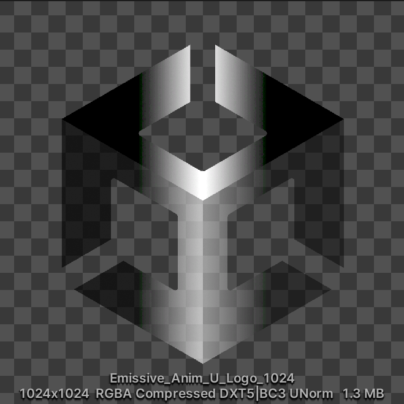

# Emission Settings

Emission controls the color and intensity of light emitted from the surface. When you use an emissive material in your scene, it appears as a visible source of light. The meshes appear to be self-illuminated.

[A chibi-style model standing between two red cubes, which light the model with emissive light.](images/EmissiveAnimation.png)

* [Emission Map](#emission-map)
* [Emission Map Animation](#emission-map-animation)
  * [Base Speed (Time)](#base-speed-time)
  * [Animation Mode](#animation-mode)
  * [Scroll U/X direction](#scroll-ux-direction)
  * [Scroll V/Y direction](#scroll-vy-direction)
  * [Rotate around UV center](#rotate-around-uv-center)
  * [Ping-pong moves for base](#ping-pong-moves-for-base)

  * [Color Shifting with Time](#color-shifting-speed-time)
    * [Destination Color](#destination-color)
    * [Color Shifting Speed (Time)](#color-shifting-speed-time)

  * [Color Shifting with View Angle](#color-shifting-with-view-angle)
    * [Shifting Target Color](#shifting-target-color)

## Emission Map
Primarily used with the Bloom Post Effect and represents luminous objects.

## Emission Map Animation
When enabled, the UV and color of the **Emission Map** animate.

<video title="A cube with the Unity logo on each face. The logo loops through the color spectrum, and vertical black bars scroll horizontally across the face." src="images/EmissionAnimation.mp4" width="auto" height="auto" autoplay="true" loop="true" controls></video>

### Base Speed (Time)
Specifies the base update speed of scroll animation. If the value is 1, it will scroll in 1 second. Specifying a value of 2 results in twice the speed of a value of 1, so it will scroll in 0.5 seconds.

Base Speed = 0.5:

<video title="A cube with a pink Unity logo on each face. Vertical black bars scroll horizontally across each face." src="images/EmissionMapBaseSpeedHalf.mp4" width="auto" height="auto" autoplay="true" loop="true" controls></video>

Base Speed = 1.5:

<video title="The same cube. The black bars scroll faster." src="images/EmissionMapBaseSpeedOneAndHalf.mp4" width="auto" height="auto" autoplay="true" loop="true" controls></video>

### Animation Mode
Controls the animated scrolling of the emissive texture.

UV Coordinate Scroll:

<video title="A cube with a pink Unity logo on each face. Vertical black bars scroll horizontally across each face." src="images/EmissionMapBaseSpeedHalf.mp4" width="auto" height="auto" autoplay="true" loop="true" controls></video>

View Coordinate Scroll:

<video title="The same cube. A black horizontal wipe effect occurs across the left and front faces." src="images/EmissionMapViewCoordinateScroll.mp4" width="auto" height="auto" autoplay="true" loop="true" controls></video>

### Scroll U/X direction
Specifies how much the Emissive texture should scroll in the U-direction (x-axis direction) when updating the animation. Base Speed (Time) x Scroll U Direction x Scroll V Direction determine the animation speed.

### Scroll V/Y direction
Specifies how much the Emissive texture should scroll in the V-direction (y-axis direction) when updating the animation. Base Speed (Time) x Scroll U Direction x Scroll V Direction determine the animation speed.

### Rotate around UV center
When Base Speed=1, the Emissive texture will rotate clockwise by 1. When combined with scrolling, rotation will occur after scrolling.

<video title="A cube with the Unity logo on each face. The logo is visible through black bars that rotate." src="images/RotateAroundUVCenter3.mp4" width="auto" height="auto" autoplay="true" loop="true" controls></video>

### Ping-pong moves for base
When enabled, you can set PingPong (back and forth) in the direction of the animation.

<video title="A cube with a pink Unity logo on each face. Vertical black bars scroll back-and-forth horizontally across each face." src="images/PingPongMove.mp4" width="auto" height="auto" autoplay="true" loop="true" controls></video>

### Color Shifting with Time
The color multiplied by the Emissive texture changes by linear interpolation (Lerp) toward the Destination Color.

#### Destination Color
Target color for [Color Shifting with Time](#color-shifting-with-time), must be in HDR.

#### Color Shifting Speed (Time)
Sets the reference speed for color shift. When the value is 1, one cycle should take around 6 seconds.

<video title="A cube with the Unity logo on each face. The logo loops through the color spectrum, and vertical black bars scroll horizontally across the face." src="images/ColorShiftingWithTime.mp4" width="auto" height="auto" autoplay="true" loop="true" controls></video>

### Color Shifting with View Angle
Emissive color shifts consistent with view angle. The further out from the front of the camera, the more it changes to [Shifting Target Color](#shifting-target-color).

#### Shifting Target Color
Target color for [Color Shifting with View Angle](#color-shifting-with-view-angle) which must be in HDR.

<video title="A cube with the Unity logo on each face. Vertical black bars scroll horizontally across the face. The front face is pink and the left and lower faces are purple." src="images/ColorShiftingWithView.mp4" width="auto" height="auto" autoplay="true" loop="true" controls></video>

