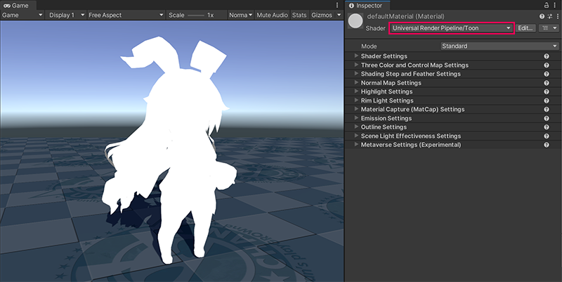
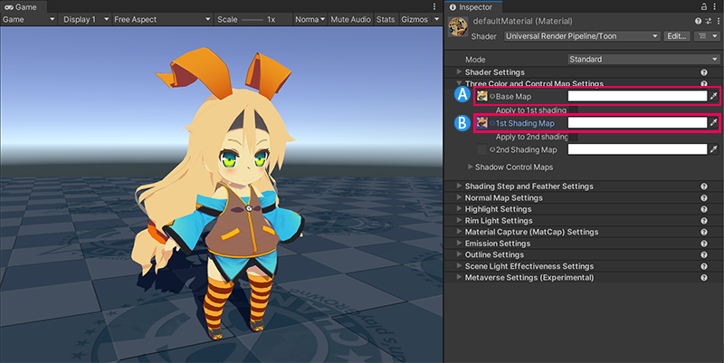
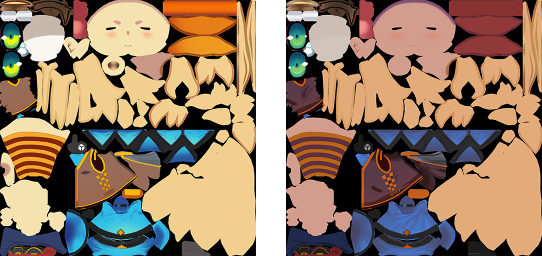
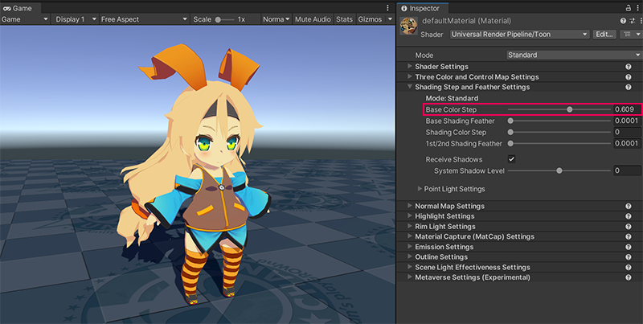
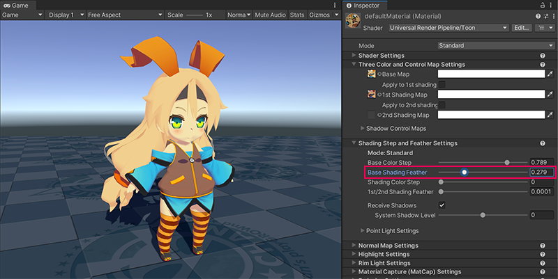
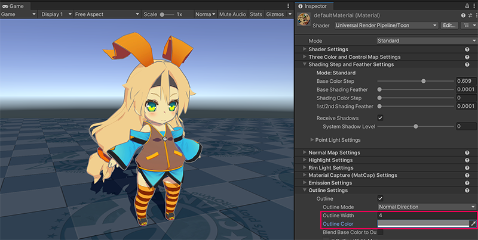
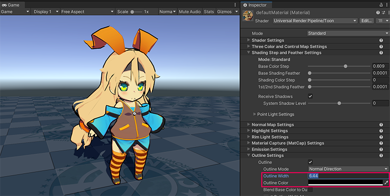
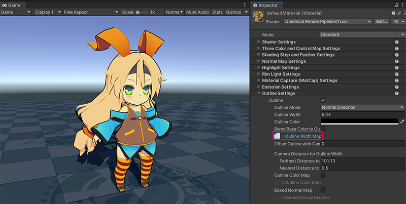
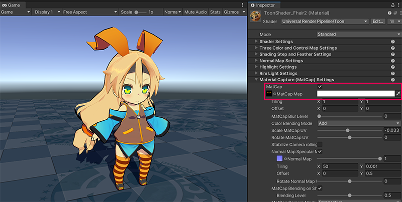

# Getting Started with Unity Toon Shader

The **Unity Toon Shader (UTS)** provides extensive controls 
for professional cel-shading across the Built-in Render Pipeline, URP, and HDRP. 
This page walks through the key concepts of cel-shading step by step.

Follow these steps for simple cel-shading:
1. [Put a directional light in the scene](#put-a-directional-light-in-the-scene).
2. [Create materials for cel-shading and set the appropriate shader](#creating-a-new-material-and-applying-unity-toon-shader).
3. [Set up three basic colors](#setting-up-three-basic-colors).
4. [Determine the character's visual style](#adjusting-the-edges-of-the-three-basic-color-regions).
5. [Set up the outline](#set-up-the-outline).

After mastering the basics, explore:

- [Advanced techniques](#advanced-techniques) such as:
    * [Eliminating outlines around eyes](#eliminating-outlines-around-eyes).
    * [Adding luster to hair](#adding-luster-to-hair).
- [More options for stunning professional cel-shading](#more-options-for-stunning-professional-cel-shading) to push the look further.

## Put a directional light in the scene

To make cel-shading work, you need to place at least one [directional light](https://docs.unity3d.com/2022.2/Documentation/Manual/Lighting.html) in the scene. 
Start with a neutral white light so you can see how UTS-specific settings influence the shading 
without additional color shifts.

## Creating a new material and applying Unity Toon Shader

Start by [creating a material](https://docs.unity3d.com/6000.0/Documentation/Manual/materials-introduction.html) for your mesh and then assign the UTS shader:

1. Create a new material and assign it to the mesh you plan to shade.
2. In the Inspector, choose **Toon > Toon** or **Toon > Toon (Tessellation)** from the Shader drop-down. 
   These shaders work on all supported render pipelines: Built-in Render Pipeline, URP, and HDRP.
3. Once assigned, the model will render as a flat silhouette until 
   you provide the texture maps that define the cel-shaded look.

The directional light will no longer control shading in the usual way because UTS overrides the lighting response according to artist-driven parameters. UTS also allows you to decide whether and how the directional light color influences materials. See [Scene Light Effectiveness Settings](SceneLight.md) for guidance.

## Setting up three basic colors

UTS renders meshes in three conceptual regions: 
1. **Base Map** for lit areas
2. **1st Shading Map** for lighter shadows, and
3. **2nd Shading Map** for the darkest tones. 

For basic cel-shading you can focus on the Base Map and 1st Shading Map. 
The [Three Color Map and Control Map Settings](Basic.md) page explains the controls in depth.

Follow these steps:
1. Author or import textures for the Base Map and 1st Shading Map. They can be separate textures or the same texture colored differently.
2. Assign the Base Map to define the fully lit colors.
3. Assign the 1st Shading Map to introduce a darker tone that UTS will show based on your shading step settings.

 
Left: an example Base Map. Right: an example 1st Shading Map.

## Adjusting the edges of the three basic color regions

The borders between your color regions drive the perceived style of the character. 
[Shading Steps and Feather Settings](ShadingStepAndFeather.md) let you adjust the position of those borders 
and whether they are sharp or blended.

Follow these steps:
1. Increase **Base Color Step** so the **1st Shading Map** becomes visible and the contrast between lit and shadowed regions matches your intent.
2. Use **Base Shading Feather** to control how crisply the regions transition. Lower values create graphic, posterized shading, while higher values blend the regions.

## Set up the outline

Outline is another important factor that determines the animation style.
Consider the outline color relative to your background and adjust the thickness to reinforce the style. 
The [Outline Settings](Outline.md) page details every property.

<canvas class="image-comparison" role="img" aria-label="The same character model. In the Inspector window of the Toon shader, the Outline Color property is set to gray, and the Outline Width property is set to 4, then 6.44.">
    
    
</canvas>
 Drag the slider to compare the images.

## Advanced techniques

Now that you've learned basic cel-shading, you can refine specific features of the character. 
The following examples illustrate how UTS helps solve common cel-shading challenges.

### Eliminating outlines around eyes

Outlines around delicate facial features can be distracting. 
Apply an [Outline Width Map](Outline.md#outline-width-map) to control outline thickness per texel so you can taper or remove the stroke where needed.

### Adding luster to hair

Flat lighting can make hair feel lifeless. 
Combine the [Highlight](Highlight.md), [Angel Ring](AngelRing.md), and [Material Capture (MatCap)](MatCap.md) features to add dimensionality. 
In this example, we'll apply a [MatCap map](MatCap.md#matcap-map) onto the hair.

## More options for stunning professional cel-shading

Once you're comfortable with the steps above, experiment with these additional features to push the look even further:

- [Emission](Emission.md) for glowing elements such as eyes, screens, or weapons.
- [Normal Map](NormalMap.md) to control the bumpiness of the material.
- [Rim Light](Rimlight.md) to highlight the edges of meshes.
