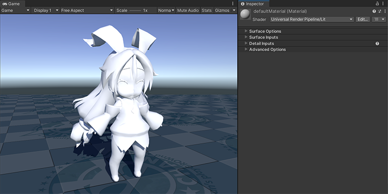
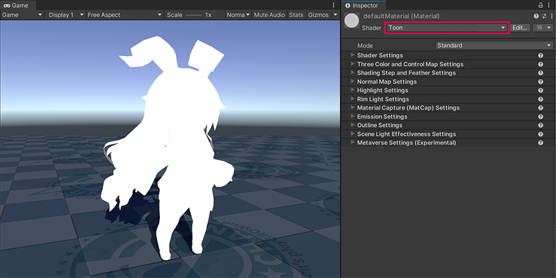
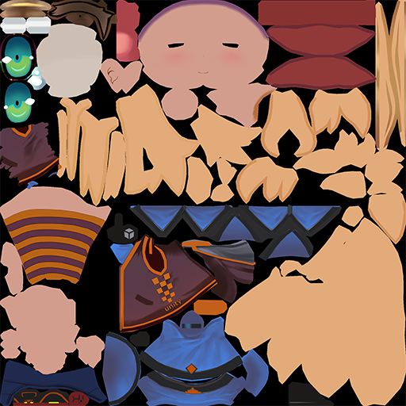
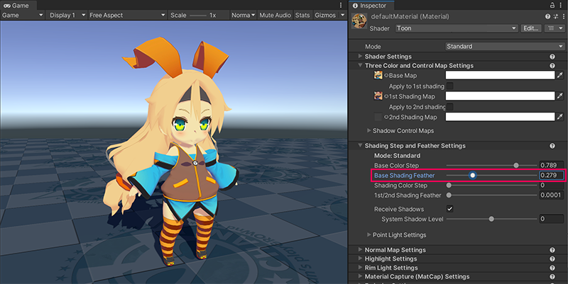

# Getting started with Unity Toon Shader

The **Unity Toon Shader**(UTS) provides tons of properties for professional cel-shading, though. In this page, you'll learn what are keys for basic cel-shading step by step. 

What you have to do for simple cel-shading are:
* [Make sure at least one directional light is in the scene](#put-a-directional-light-in-the-scene).
* [Create materials for cel-shading and set appropriate shader path](#creating-a-new-material-and-applying-unity-toon-shader).
* [Set up three basic colors](#setting-up-three-basic-colors).
* [Determine touch of the character](#adjusting-edge-of-three-basic-color-region).
* [Set Outline](#set-outline).

After mastering above you might want to check:
* [Advanced techniques](#advanced-techniques).
  * [Eliminate outlines around eyes](#eliminating-outlines-around-eyes).
  * [Add luster to hair](#adding-luster-to-hair).
* [Options for stunning professional cel-shading](#more-options-for-stunning-professional-cel-shading).

## Put a directional light in the scene
To make cel-shading work. You need to place at least one [directional light](https://docs.unity3d.com/2022.2/Documentation/Manual/Lighting.html) in the scene.

## Creating a new material and applying Unity Toon Shader

Start from [creating a material](https://docs.unity3d.com/2022.2/Documentation/Manual/materials-introduction.html).

 
Selecting the appropriate shader for the material. 

Because the **Unity Toon Shader**(UTS) is capable of all the render pipelines, the Built-in Render Pipeline, URP, and HDRP, The shaders you need to choose are just Toon or Toon(Tessellation). They are not under Universal Render Pipeline nor HDRP in menus.

You see the directional light isn't affecting like usual shading. This is because UTS controls the response of the lighting according to the artist's intentions. UTS allows detailed control whether the directional light color effects on materials. Please refer to [Scene Light Effectiveness Settings](SceneLight.md). But, while learning this section, setting the light color to **white** is recommendable. 

## Setting up three basic colors

The most basic function of the UTS is to render the mesh in three regions. **Base Map** for regions with no shadows, **1st shading map** for regions with shaded lighter , and **2nd shading map** for regions with shaded darker. [Three Color Map and Control Map Settings](Basic.md) provide the properties to control this fundamental settings. For basic cel-shading, two maps, **Base Map** and **1st Shading Map** work fine.

 

Applying the Base Map and 1st Shading Map to the material. The difference between the two texture is the color tone. In this sample, applied two different textures. But, applying one texture and differ colors to apply is also possible.

 
An example Base Map.

 
An example 1st Shading Map.

## Adjusting edge of three basic color region

Touch of the image is one of the most important factors that determine the style of the work. [Shading Steps and Feather Settings](ShadingStepAndFeather.md) provides  ways to adjust the position of the border between the regions and whether they're clearly separated or blended. First, you should adjust  **Base Color Step** to make  **1st Shading Map**, darker texture above, displayed.

 

In the above, the boundary of **Base Map** and **1st Shading Map** is cleary separated. Try adjusting **Base Shading Feather** to see how to control the boundary clearness. Sometimes, blended borders are favorable.

 

## Set outline
The Outline is another important factor that determines the animation touch. The color of the border should be close to the background or clearly distinguishable, and its thickness affects the style of the animation. [Outline Settings](Outline.md) provides the properties to control them.

<canvas class="image-comparison" role="img" aria-label="The same character model. In the Inspector window of the Toon shader, the Outline Color property is set to gray, and the Outline Width property is set to 4, then 6.44.">
    
    
</canvas>
 Drag the slider to compare the images.

## Advanced techniques
Now, you  learned basic cel-sheding. But, professional cel-shading often requires more treatments. You will learn a couple of techniques in this section.

### Eliminating outlines around eyes
Look at the character's face above again. You will notice outlines around characters' eyes spoiling the images. UTS provides  [Outline Width Map](Outline.md#outline-width-map) to solve this. By applying that map, you can control the thickness of outlines around every part of the meshes to your satisfaction.

### Adding luster to hair
You might still see the image  appear flat and lacking in three-dimensionality.
[Highlight](Highlight.md) on hair is common expression in anime production. 
[Angel Ring](AngelRing.md) and [Material Capture(MatCap)](MatCap.md) are more specialized for hair luster. This time, apply MatCap on the hair. Create another material, then set [MatCap map](MatCap.md#matcap-map) in it.

## More options for stunning professional cel-shading
The following factors are also essential in nowadays animation/game production when using cel-shading. Please try these out after mastering this page.

* [Emission](Emission.md)
* [Normal Map](NormalMap.md)
* [Rim Light](Rimlight.md)

