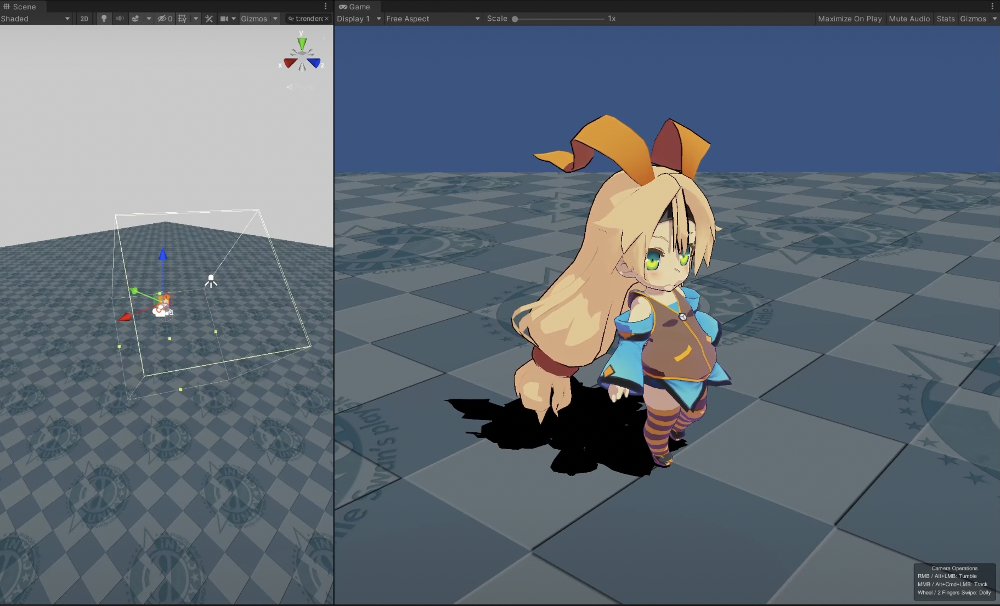

## HDRP Box Light

In HDRP, [only one directional light can cast shadow at a time](https://docs.unity3d.com/Manual/render-pipelines-feature-comparison.html).
This can be undesirable when we need lighting that differs from the scene's main directional light,
such as brightening a character's face or adding idealized shadows.

The [Box Light](https://docs.unity3d.com/Packages/com.unity.render-pipelines.high-definition@14.0/manual/Light-Component.html#Shape)
offers a practical workaround, and Unity Toon Shader supports it.
<canvas class="image-comparison" role="img" aria-label="The Scene view with a cube representing a box light, and the Game view with a chibi-style character model. When the box light is rotated, the shadows on the face of the model change.">
    
    
</canvas>
 
Drag the slider to compare the images.

<small>Box light applied to a character's face. Note that editing the angle of the box changes the shadows falling on the face, but not on the body and the ground.</small>
