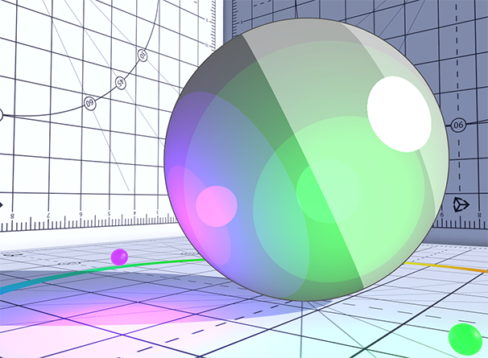
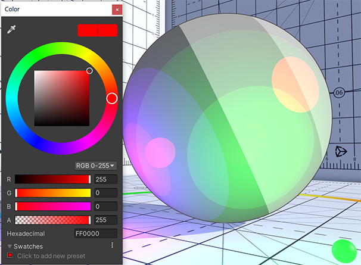
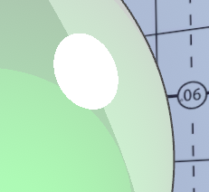
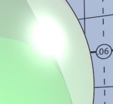
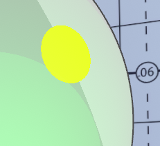
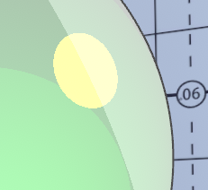
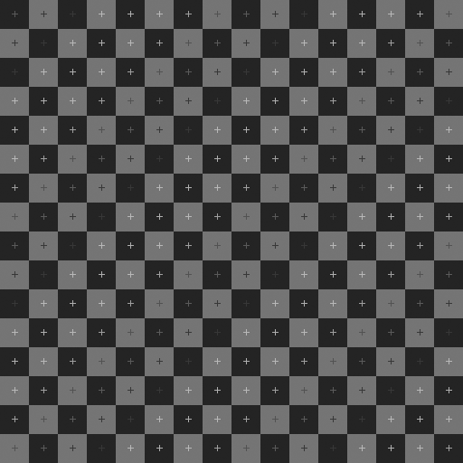
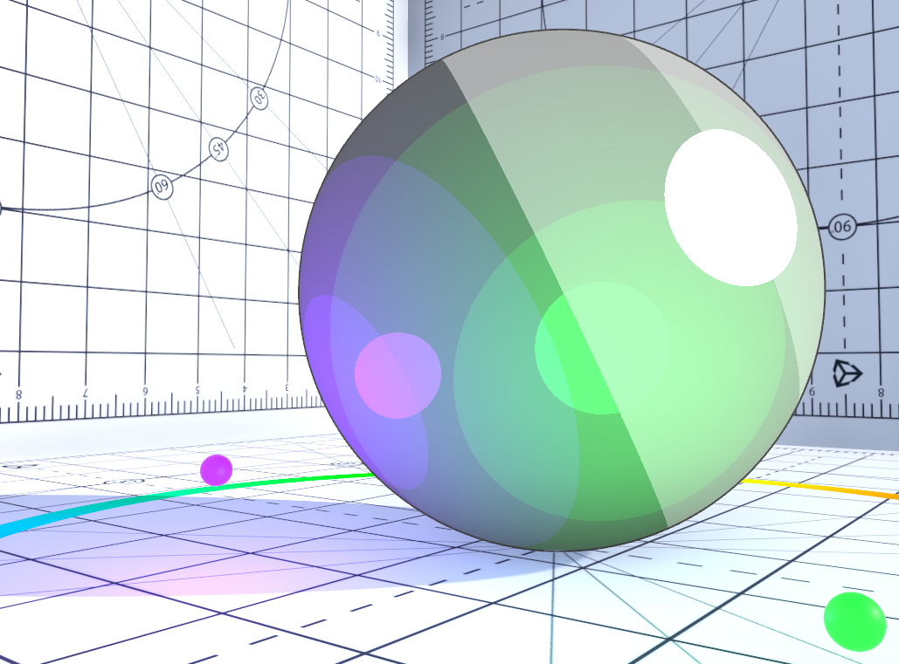
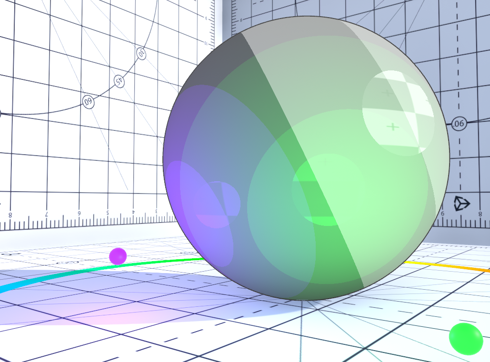

# Highlight Settings

The ability to display specular highlights in a cel-animation-like manner is essential for toon shaders. The **Unity Toon Shader** provides a wide variety of expressions with controllable illumination that works independently of light color and intensity for impressive cel-shading.

Settings:
* [Highlight](#highlight)
* [Highlight Power](#highlight-power)
* [Specular Mode](#specular-mode)
  * [Color Blending Mode](#color-blending-mode)
* [Highlight Blending on Shadows](#highlight-blending-on-shadows)
  * [Blending Level](#blending-level)
* [Highlight Mask](#highlight-mask)
* [Highlight Mask Level](#highlight-mask-level)

## Highlight
Highlight: Texture(sRGB) × Color(RGB). Defines the pattern and tint of the specular highlight.

Default: white.

<canvas class="image-comparison" role="img" aria-label="A toon-shaded sphere in a room textured with graphs. The sphere has green and purple bands of color, and a bright white specular highlight. Then the same sphere, with the color picker window open and the color #FF0000 selected. The specular highlight on the sphere is now orange and yellow.">
    
    
</canvas>
 Drag the slider to compare the images.

## Highlight Power

The highlight size is controlled by the **Highlight Power** slider. 

<video title="Tweaking the highlight power." src="images/SpecularPower.mp4" width="auto" height="auto" autoplay="true" loop="true" controls></video>

## Specular Mode

UTS provides two modes for the highlight for different occasions and effect. The hard mode provides a crisp and solid edge to the highlight while the soft mode provides a blended blurred effect.

<canvas class="image-comparison" role="img" aria-label="A close-up of a white specular highlight on a green sphere. The highlight is a clear white disc with a hard edge. Then the same close-up. The specular highlight is now a blurred white disc.">
    
    
</canvas>
 Drag the slider to compare the images.

  

### Color Blending Mode
Specular color blending mode allows the user to control the hardness of the colour applied to the highlight. 
Users have two options: Multiply or Add.

Note that **Color Blending Mode** is disabled when **Specular** Mode is set to **Soft**.

<canvas class="image-comparison" role="img" aria-label="A close-up of a yellow specular highlight on a green sphere. The highlight is a clear yellow disc with a hard edge. Then the same close-up. The specular highlight is now a blurred yellow disc.">
    
    
</canvas>
 Drag the slider to compare the images.

## Highlight Blending on Shadows
Control the blending for the highlights in shadows. Please refer to the image at [Blending Level](#blending-level).

### Blending Level
Adjusts the intensity of highlight applied to shadow areas.

<video title="A specular highlight on a green sphere. Part of the highlight is in shadow, and fades in and out." src="images/HighlightBlendingLevel.mp4" width="auto" height="auto" autoplay="true" loop="true" controls></video>

## Highlight Mask
A gray scale texture which utilises its brightness to control highlight intensity. Applying the highlight mask allows to fine-tune the reflectivity on the material.

 
An example of a grayscale texture highlight mask.

<canvas class="image-comparison" role="img" aria-label="A toon-shaded sphere in a room textured with graphs. The sphere has green and purple bands of color, and circular green, white, and purple specular highlights. Then the same sphere. The specular highlights now reflect the checkerboard pattern.">
    
    
</canvas>
 Drag the slider to compare the images.

## Highlight Mask Level
Highlight mask texture blending level to highlights.

<video title="A toon-shaded sphere in a room textured with graphs. The specular highlights fade in and out." src="images/HighlightMaskLevel.mp4" width="auto" height="auto" autoplay="true" loop="true" controls></video>