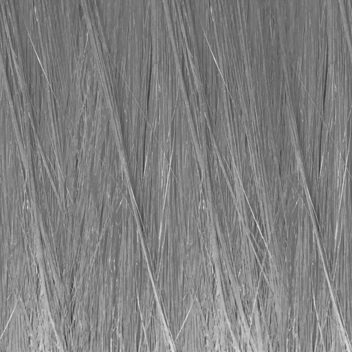

# Material Capture (MatCap) Settings

MatCap is a method of light expression using pre-rendered images. 
This technique uses a image of a sphere that represents the material and light to simulate lighting.

<video title="A camera pan over the head of a chibi-style character model with long hair and rabbit ears. The specular highlights on the ears and hair move with the camera." src="images/MatCap.mp4" width="auto" height="auto" autoplay="true" loop="true" controls></video>

* [MatCap Map](#matcap-map)
* [MatCap Blur Level](#matcap-blur-level)
* [Color Blending Mode](#color-blending-mode)
* [Scale MatCap UV](#scale-matcap-uv)
* [Rotate MatCap UV](#rotate-matcap-uv)
* [Stabilize Camera rolling](#stabilize-camera-rolling)
* [Normal Map Specular Mask for MatCap](#normal-map-specular-mask-for-matcap)
  * [Normal Map](#normal-map)
  * [Rotate Normal Map UV](#rotate-normal-map-uv)
* [MatCap Blending on Shadows](#matcap-blending-on-shadows)
  * [Blending Level](#blending-level)
* [MatCap Camera Mode](#matcap-camera-mode)
* [MatCap Mask](#matcap-mask)
  * [MatCap Mask Level](#matcap-mask-level)
  * [Invert MatCap Mask](#invert-matcap-mask)

## MatCap Map
MatCap Color: Texture(sRGB) × Color(RGB). 

Default: White

 
An example of a MatCap Map texture.

<video title="A camera pan over the head of a chibi-style character model with long hair and rabbit ears." src="images/WithOutMatCap.mp4" width="auto" height="auto" autoplay="true" loop="true" controls></video> 
MatCap Map disabled.

<video title="The same camera pan, but the blonde hair of the model now has a brighter yellow specular highlight." src="images/WithMatCap.mp4" width="auto" height="auto" autoplay="true" loop="true" controls></video> 
MatCap Map enabled.

## MatCap Blur Level
Blur MatCap Map using the Mip Map feature. 

To enable Mip Map, activate Advanced > Generate Mip Maps in the [Texture Import Settings](https://docs.unity3d.com/Manual/class-TextureImporter.html). 

<video title="A close-up on the blonde hair of a chibi-style character model. The brighter yellow specular highlight changes from sharp to blurred." src="images/MatCapBlurLebel.mp4" width="auto" height="auto" autoplay="true" loop="true" controls></video>

## Color Blending Mode
MatCap color blending mode. Multiply or Add.

## Scale MatCap UV
Scaling UV of MatCap Map.

<video title="A close-up on the blonde hair of a chibi-style character model. The brighter yellow specular highlight changes from a thin line to a wider highlight." src="images/ScaleMatCapUV.mp4" width="auto" height="auto" autoplay="true" loop="true" controls></video>

## Rotate MatCap UV
Rotating UV of MatCap Map.

<video title="A close-up on the blonde hair of a chibi-style character model. The yellow specular highlight rotates from left to right and back." src="images/RotateMatCapUV.mp4" width="auto" height="auto" autoplay="true" loop="true" controls></video>

## Stabilize Camera Rolling
Stabilize Camera rolling when capturing materials with camera.

<video title="A close-up on the face of a chibi-style character model. When the camera rotates, the specular highlights stay in the same place in the camera view." src="images/StabilizerOff.mp4" width="auto" height="auto" autoplay="true" loop="true" controls></video> 
Stabilize Camera Rolling disabled.

<video title="The same close-up. When the camera rotates, the specular highlights stay in the same place on the hair." src="images/StabilizerOn.mp4" width="auto" height="auto" autoplay="true" loop="true" controls></video> 
Stabilize Camera Rolling enabled.

## Normal Map Specular Mask for MatCap

When enabled, uses a dedicated normal map for MatCap.
If MatCap is used as specular lighting, this normal map can serve as a specular mask.

<canvas class="image-comparison" role="img" aria-label="A view from above a chibi-style character model with blonde hair and brighter yellow specular highlights. Then the same view. The individual hairs now have highlights. ">
    
    
</canvas>
 Drag the slider to compare the images.

### Normal Map
A texture that dictates the bumpiness of the material.

 
An example of a Normal Map texture.

### Rotate Normal Map UV
Rotates the MatCap normal map UV based on its center.

<video title="A view from above a chibi-style character model with blonde hair and brighter yellow specular highlights on individual hairs. The highlights rotate." src="images/RotateMatCapNormalMapUV.mp4" width="auto" height="auto" autoplay="true" loop="true" controls></video>

## MatCap Blending on Shadows
Enables the blending rate of the MatCap range in shadows.

<canvas class="image-comparison" role="img" aria-label="A view from above a chibi-style character model with blonde hair. With MatCap Blending on Shadows on, the bright highlights on individual hairs are less visible.">
    
    
</canvas>
 Drag the slider to compare the images.

## Blending Level
Adjusts the intensity of MatCap applied to shadow areas.

<video title="Adjusts the intensity of MatCap applied to shadow areas." src="images/MatCapOnShadowLevel.mp4" width="auto" height="auto" autoplay="true" loop="true" controls></video> 

## MatCap Camera Mode
Control how the MatCap Map is rendered based on the camera type.

## MatCap Mask

The MatCap mask aligns with the mesh’s UVs used for the MatCap projection. 
Pixels in black (0) regions of the mask are fully hidden.

## MatCap Mask Level
Adjusts the level of the MatCap Mask. When the value is: 
* 1: MatCap represents 100% irrespective of mask. 
* -1: MatCap won't be displayed at all and MatCap will be the same as in the off state.

<video title="Specular highlights on hair fade in and out." src="images/MatCapMaskLevel.mp4" width="auto" height="auto" autoplay="true" loop="true" controls></video>

## Invert MatCap Mask
When enabled, inverts **MatCap Mask** Texture colors.

