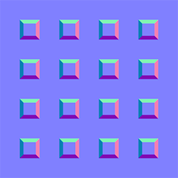
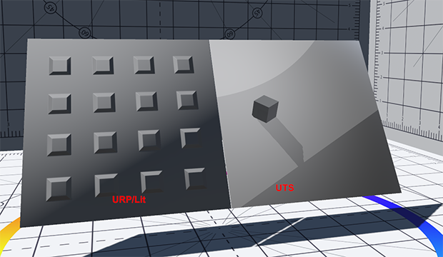

# Normal Map Settings

A Normal Map is a texture that dictates the bumpiness of the material. The **Unity Toon Shader** allows control over **Normal Map** strength and which areas it applies to.

* [Normal Map](#normal-map)
* [Normal Map Effectiveness](#normal-map-effectiveness)
* [Example of Normal Map Effectiveness Operation](#example-of-normal-map-effectiveness-operation)
  

## Normal Map
A Normal Map texture and its strength.

Examples of a normal map with a strength of 1.0, 0.3, and 0.0:

 
Strength: 1.0.

 
Strength: 0.3.

 
Strength: 0.0.

## Normal Map Effectiveness

|Properties| Description |
| ---- | ---- |
| Three Basic Colors | The effectiveness of the Normal Map on Three Basic color areas, lit, the 1st shading and the 2nd. |
| Highlight | Normal map effectiveness to high lit areas. |
| Rim Light | Normal map effectiveness to rim lit areas. |

  

## Example of Normal Map Effectiveness Operation

<video title="The example normal map applied to a plane using the URP/Lit shader on the left side and the UTS shader on the right side. When Three Basic Colors is selected in the Inspector window, the raised squares appear. When Highlight is also selected, the raised squares have a higher contrast. When Rim Light is also selected, the edges of the squares are much brighter." src="images/NormalmapEffectiveness.mp4" width="auto" height="auto" autoplay="true" loop="true" controls></video>

