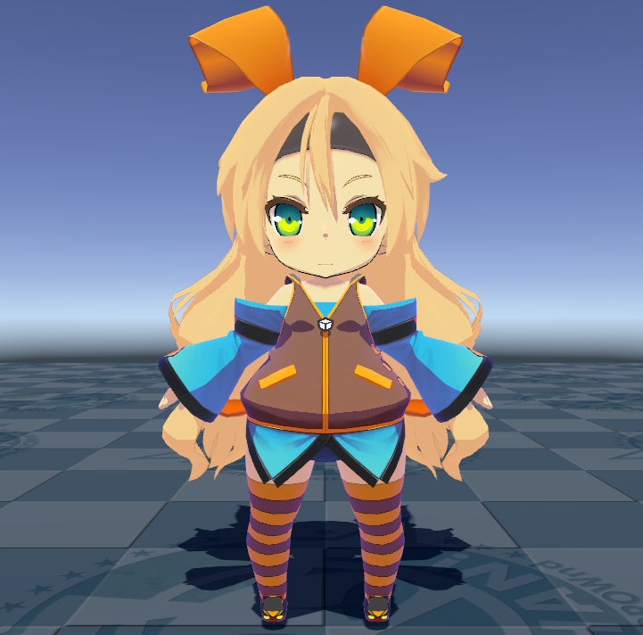
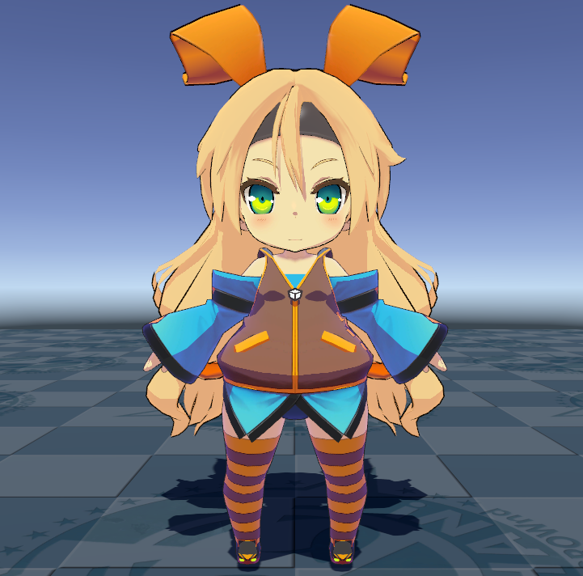
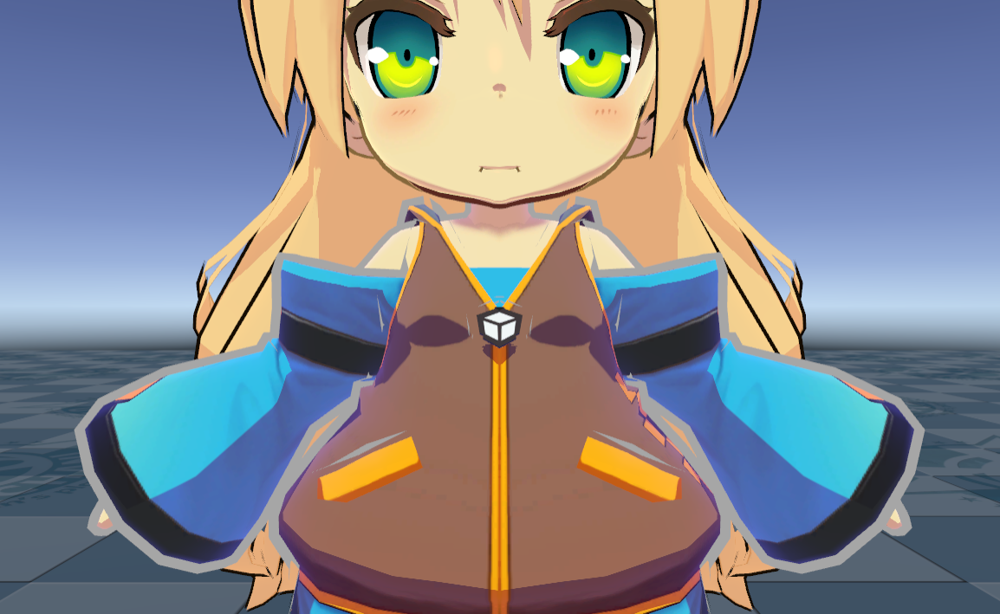
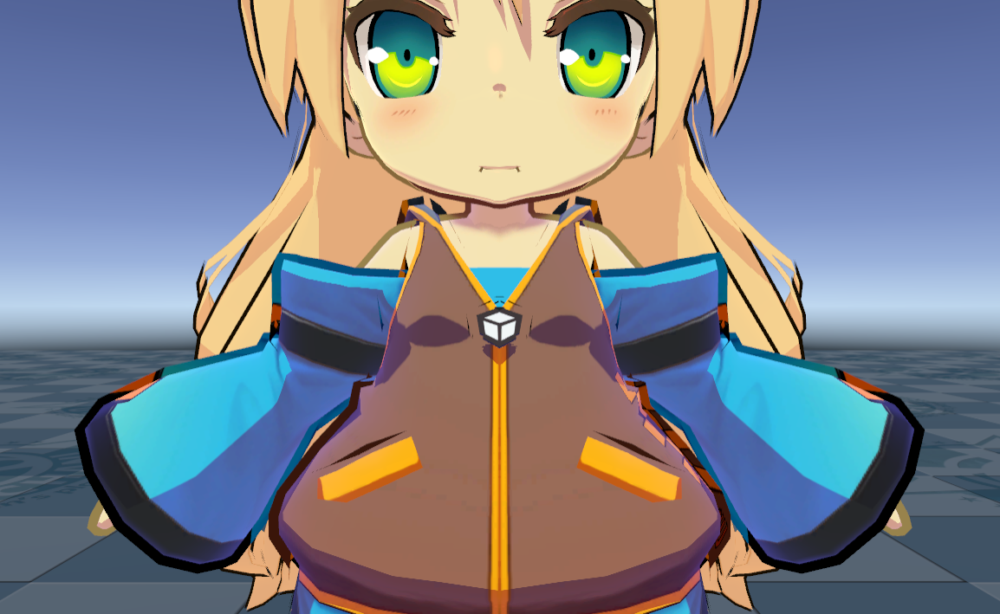
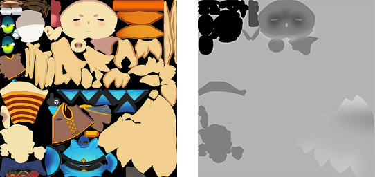
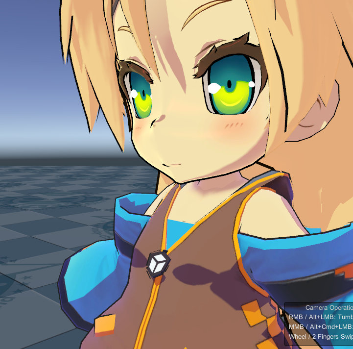
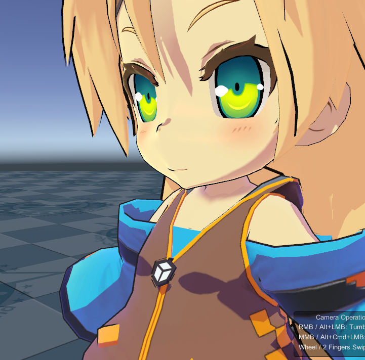
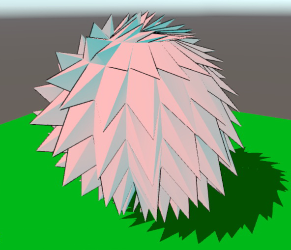
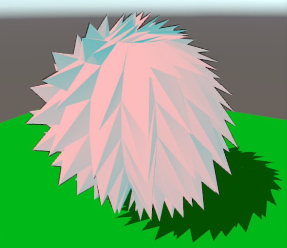

# Outline Settings

Outlines are one of the most important elements that affect the impression of cel-animated images. 
You can control the outline thickness numerically, and refine it in more detail using an Outline Width Map.
Outline color can be set directly or blended with the character's base colors.

<canvas class="image-comparison" role="img" aria-label="A chibi-style character model with rabbit ears. The first image has no outline. The second image has an outline.">
    
    
</canvas>
 Drag the slider to compare the images. 

UTS provides two methods to generate outlines: 
1. Extrude polygons along the mesh normals.
2. Scale the mesh uniformly to create an outline.

Settings:
* [Outline Mode](#outline-mode)
* [Outline Width](#outline-width)
* [Outline Color](#outline-color)
* [Blend Base Color to Outline](#blend-base-color-to-outline)
* [Outline Width Map](#outline-width-map)
* [Offset Outline with Camera Z-axis](#offset-outline-with-camera-z-axis)
* [Camera Distance for Outline Width](#camera-distance-for-outline-width)
  * [Farthest Distance to vanish](#farthest-distance-to-vanish)
  * [Nearest Distance to draw with Outline Width](#nearest-distance-to-draw-with-outline-width)
* [Outline Color Map](#outline-color-map)
* [Baked Normal Map](#baked-normal-map)

## Outline Mode
Specifies how the inverted-outline objects spawn.

| Outline Mode | Description |
| -- | -- |
| Normal Direction | Stretches polygons in the normal direction. |
| Position Scaling | Applies a scale value to the mesh. |

## Outline Width
Specifies the width of the outline. This value depends on the scale when importing the model to Unity.

## Outline Color
Specifies the color of the outline.

## Blend Base Color to Outline
Blends **Base Color** into the outline color.

<canvas class="image-comparison" role="img" aria-label="A chibi-style character model with a thick outline. With Blend Base Color to Outline disabled, the outline is black. With Blend Base Color to Outline enabled, the outline matches the colors of the adjacent texture.">
    
    
</canvas>
 
Drag the slider to compare the images.

## Outline Width Map
Outline Width Map as grayscale texture: Texture(linear).

UTS provides a detailed control solution for outline thickness using a texture map. 
Let's take a look at an example.

 
Left: a Base Map example. Right: an Outline Width Map example.

With the above maps applied, regions that are white in the Outline Width Map produce thicker outlines. 
This is especially noticeable around the character's eyes and face.

<canvas class="image-comparison" role="img" aria-label="A chibi-style character model with rabbit ears. The model has outlining which becomes thinner, and the outlines around the eyes of the character disappear.">
    
    
</canvas>
 
Drag the slider to compare the images.

## Offset Outline with Camera Z-axis
Offsets the outline in the depth (Z) direction of the camera. UTS outline is implemented by either extending polygons in the normal direction or applying a scale value. Sometimes, offsetting the position of the generated polygons in the Z (depth) direction can improve their appearance.

<canvas class="image-comparison" role="img" aria-label="A spiky pink ball. In the first image, the outline is a consistent thickness. In the second image, the outline is only visible at the edges.">
    
    
</canvas>
 
Drag the slider to compare the images.

## Camera Distance for Outline Width

### Farthest Distance to vanish
Specifies the furthest distance where the outline width changes with the distance between the camera and the object. The outline will be zero at this distance.

### Nearest Distance to draw with Outline Width
Specifies the closest distance where the outline width changes with the distance between the camera and the object. At this distance, the outline will be the maximum width set by Outline_Width.

## Outline Color Map
Apply a texture as the outline color map.

## Baked Normal Map
Normal maps with vertex normals baked in from other models can be loaded as an addition when setting up normal inversion outlines.