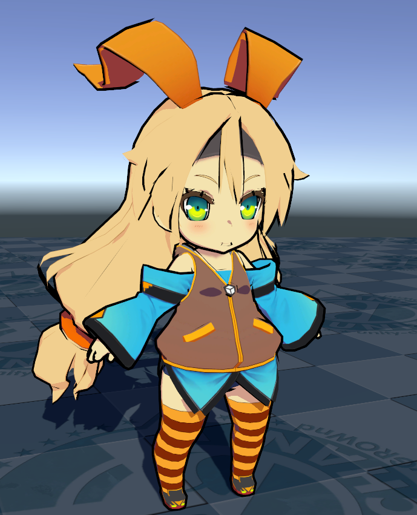
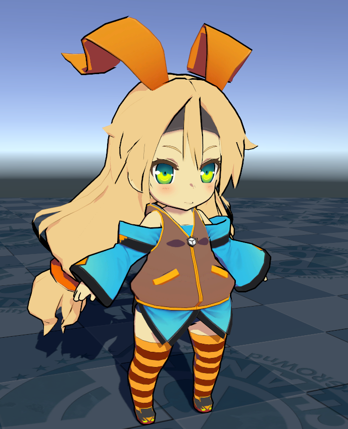

# Outline Settings

Outlines are one of the most important elements that  affect the impression of a cell-animated images. You can specify the thickness of the outline not just numerically, but can also change the thickness in detail using a special map. You can also specify  the color not just numerically but blend outline colors with the character body colors. UTS offers two methods to generate outlines: one is to stretch polygons in the normal direction, and the other is to apply a scale value to the mesh.

* [Outline](#outline)
  * [Outline Mode](#outline-mode)
  * [Outline Width](#outline-width)
  * [Outline Color](#outline-color)
  * [Blend Base Color to Outline](#blend-base-color-to-outline)
  * [Outline Width Map](#outline-width-map)
  * [Offset Outline with Camera Z-axis](#offset-outline-with-camera-z-axis)
  * [Camera Distance for Outline Width](#camera-distance-for-outline-width)
    * [Farthest Distance to vanish](#farthest-distance-to-vanish)
    * [Nearest Distance to draw with Outline Width](#nearest-distance-to-draw-with-outline-width)

  * [Outline Color Map](#outline-color-map)
  * [Baked Normal Map](#baked-normal-map)

## Outline 
A checkbox to enable outline.

<canvas class="image-comparison" role="img" aria-label="A chibi-style character model with rabbit ears. The first image has no outline. The second image has an outline.">
    
    
</canvas>
 Drag the slider to compare the images.

### Outline Mode
Specifies how the inverted-outline objects spawn.

| Outline Mode | Description |
| -- | -- | 
| Normal Direction | Stretches polygons in the normal direction. |
| Position Scaling | Applies a scale value to the mesh. |

### Outline Width
Specifies the width of the outline. This value relies on the scale when importing the model to Unity

### Outline Color
Specifies the color of outline.

### Blend Base Color to Outline
Blends **Base Color** into outline color. 

<canvas class="image-comparison" role="img" aria-label="A chibi-style character model with a thick outline. With Blend Base Color to Outline disabled, the outline is black. With Blend Base Color to Outline enabled, the outline matches the colors of the adjacent texture.">
    
    
</canvas>
 
Drag the slider to compare the images.

### Outline Width Map
Outline Width Map as gray scale Texture : Texture(linear). UTS provides  meticulous control solution for outline thickness as a texture map. Look at the difference of the outlines around the character's eyes and face.

<canvas class="image-comparison" role="img" aria-label="A chibi-style character model with rabbit ears. The model has outlining which becomes thinner, and the outlines around the eyes of the character disappear.">
    
    
</canvas>
 
Drag the slider to compare the images.

You will notice that the outlines of the white areas appear thicker in the texture map.

 
An example of a Base Map.

 
The Outline Width Map applied above.

### Offset Outline with Camera Z-axis
Offsets the outline in the depth (Z) direction of the camera. UTS outline is an implementation of either extending polygons in the normal direction or applying a scale value. Sometimes, offsetting the position of the generated polygons in the Z (depth) direction can improve their appearance. 

<canvas class="image-comparison" role="img" aria-label="A spiky pink ball. In the first image, the outline is a consistent thickness. In the second image, the outline is only visible at the edges.">
    
    
</canvas>
 
Drag the slider to compare the images.

### Camera Distance for Outline Width

#### Farthest Distance to vanish
Specify the furthest distance, where the outline width changes with the distance between the camera and the object. The outline will be zero at this distance.

#### Nearest Distance to draw with Outline Width
Specify the closest distance, where the outline width changes with the distance between the camera and the object. At this distance, the outline will be the max width set by Outline_Width.

### Outline Color Map
Apply a texture as outline color map.

### Baked Normal Map
Normal maps with vertex normals  baked in from other models can be loaded as an addition when setting up normal inversion outlines. 