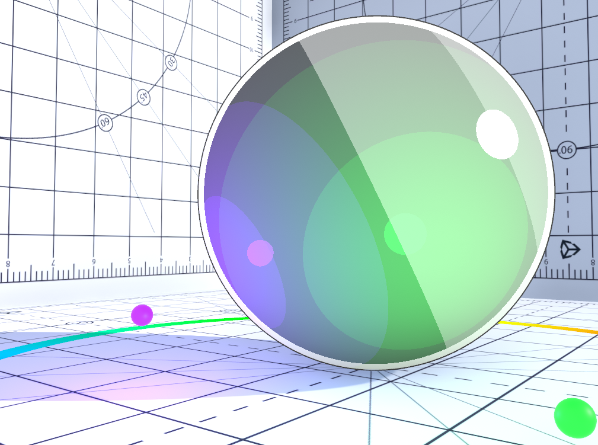
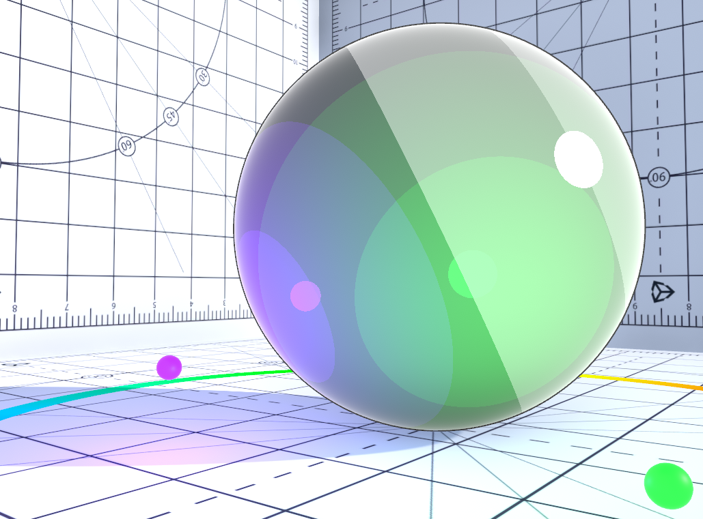
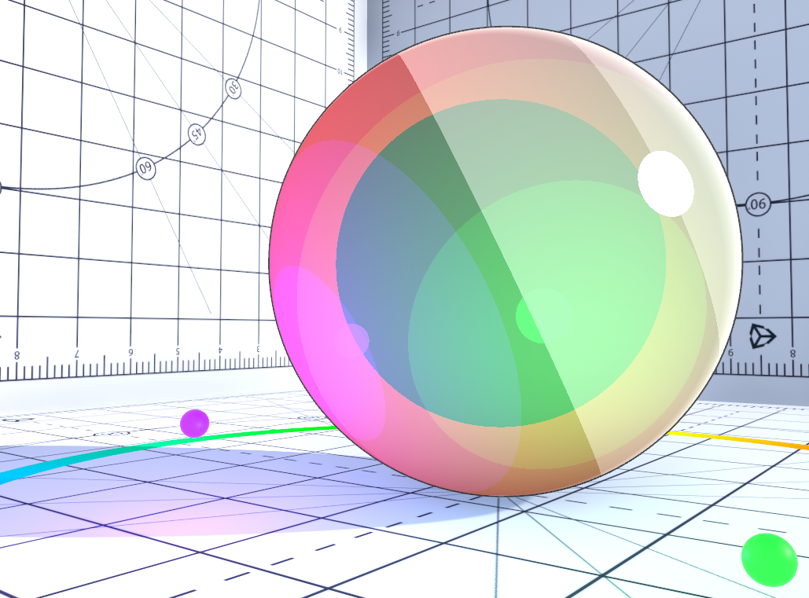
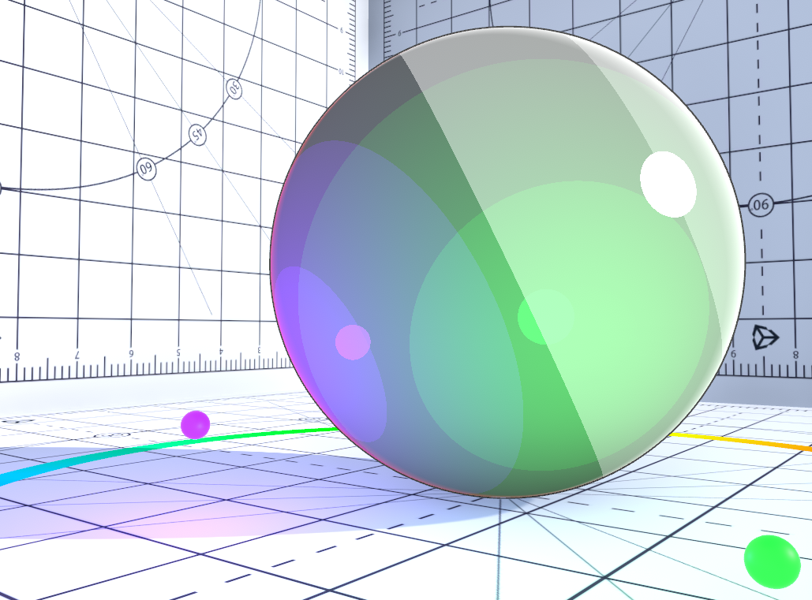
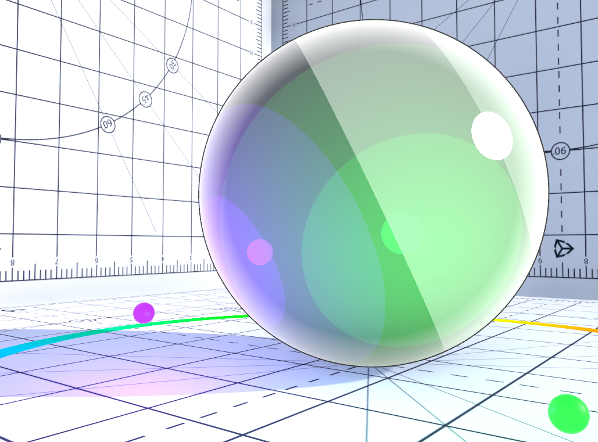

# Rim Light Settings

Rim Light highlights the edges of meshes. Rim Light is based on the angle between the surface normal and view direction. The **Unity Toon Shader** provides a variety of options for Rim Light.

* [Rim Light](#rim-light)
  * [Rim Light Color](#rim-light-color)
  * [Rim Light Level](#rim-light-level)
  * [Adjust Rim Light Area](#adjust-rim-light-area)
  * [Rim Light Feather Off](#rim-light-feather-off)
  * [Light Direction](#light-direction)
  * [Light Direction Rim Light Level](#light-direction-rim-light-level)
  * [Inverted Light Direction Rim Light](#inverted-light-direction-rim-light)
    * [Inverted Rim Light Color](#inverted-light-direction-rim-light)
    * [Inverted Rim Light Level](#inverted-rim-light-level)
    * [Inverted Rim Light Feather Off](#inverted-rim-light-level)

  * [Rim Light Mask](#rim-light-mask)
  * [Rim Light Mask Level](#rim-light-mask-level)

## Rim Light
A checkbox to enable **Rim Light** that hits the 3D model from behind and emphasizes the contours of the model from the front.

<canvas class="image-comparison" role="img" aria-label="A toon-shaded sphere in a room textured with graphs. The sphere has green and purple bands of color, and specular highlights. With Rim Light enabled, the sphere is bright at the edge.">
    
    
</canvas>
 
Drag the slider to compare the images.

### Rim Light Color
Specifies the color of **Rim Light**.

### Rim Light Level
Specifies **Rim Light** intensity.

<video title="The same sphere. The intensity of the bright edge grows and shrinks, affecting almost the whole sphere." src="images/RimLightLevel.mp4" width="auto" height="auto" autoplay="true" loop="true" controls></video>
 

### Adjust Rim Light Area
Increasing this value narrows the area of influence of **Rim Light**.

<video title="The same sphere. The bright light appears at the edge, then the sphere becomes lighter as a whole." src="images/AdjustRimLightArea.mp4" width="auto" height="auto" autoplay="true" loop="true" controls></video>
 

### Rim Light Feather Off
A check box to disable **Rim Light** feather.

<canvas class="image-comparison" role="img" aria-label="A toon-shaded sphere in a room textured with graphs. With Rim Light Feather disabled, the bright edge appears thicker and sharper.">
    
    
</canvas>
 
Drag the slider to compare the images.

### Light Direction
A Checkbox to enable light direction. When Enabled, generates **Rim Light** in the direction of the light source.

<canvas class="image-comparison" role="img" aria-label="A toon-shaded sphere in a room textured with graphs. The light direction changes as Light Direction is disabled and enabled.">
    
    
</canvas>
 
Drag the slider to compare the images.

### Light Direction Rim Light Level
Specifies intensity of **Rim Light** in the light source direction.

### Inverted Light Direction Rim Light
Light color effectiveness to inverted direction rim lit areas.

<canvas class="image-comparison" role="img" aria-label="A toon-shaded sphere in a room textured with graphs. With Inverted Light Direction Rim Light disabled, the sphere has bright edges on both sides.">
    
    
</canvas>
 
Drag the slider to compare the images.

#### Inverted Rim Light Color
Specifies the color of inverted/antipodean **Rim Light**.

#### Inverted Rim Light Level
Specifies Inverted/Antipodean **Rim Light** Level.

#### Inverted Rim Light Feather Off
Disable Inverted **Rim Light** feather.

<canvas class="image-comparison" role="img" aria-label="A toon-shaded sphere in a room textured with graphs. With Inverted Rim Light Feather disabled, the sphere has a thick ring of red, orange and purple.">
    
    
</canvas>
 
Drag the slider to compare the images.

### Rim Light Mask
Rim Light Mask : a gray scale texture(linear). The white part of the texture represents **Rim Light**, and the black part masks.

 
Grayscale texture example.

<canvas class="image-comparison" role="img" aria-label="A toon-shaded sphere in a room textured with graphs. With Rim Light Mask enabled, the edge of the sphere reflects the room.">
    
    
</canvas>
 
Drag the slider to compare the images.

### Rim Light Mask Level
-1 gives 0% for the Rim Light effect, 0 gives 100% for the Rim Light and Mask effect, 1 gives 100% for the Rim Light and 0% for the Mask effect.

<video title="Rim light fades in and out." src="images/RimLightMaskLevel.mp4" width="auto" height="auto" autoplay="true" loop="true" controls></video>
