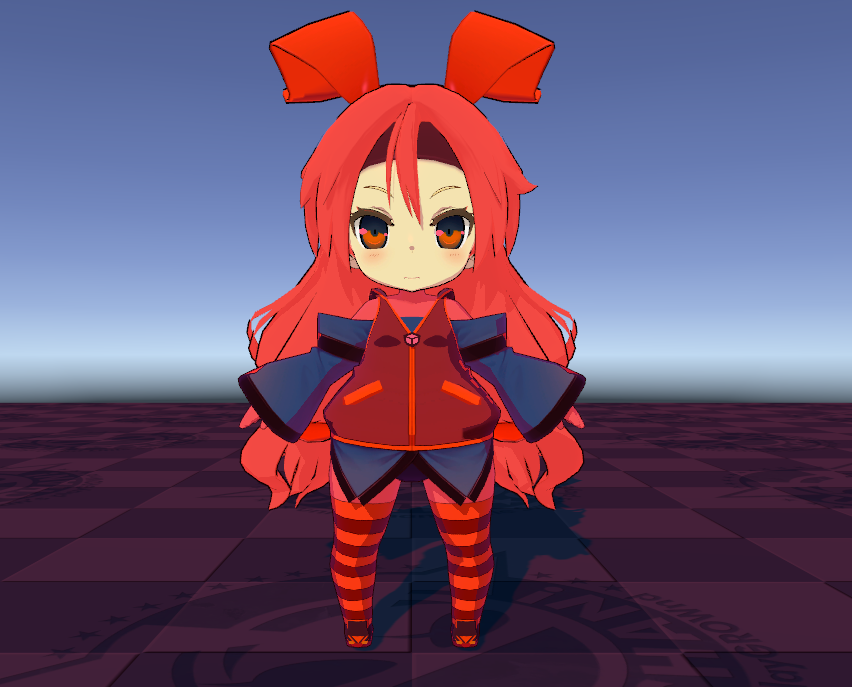
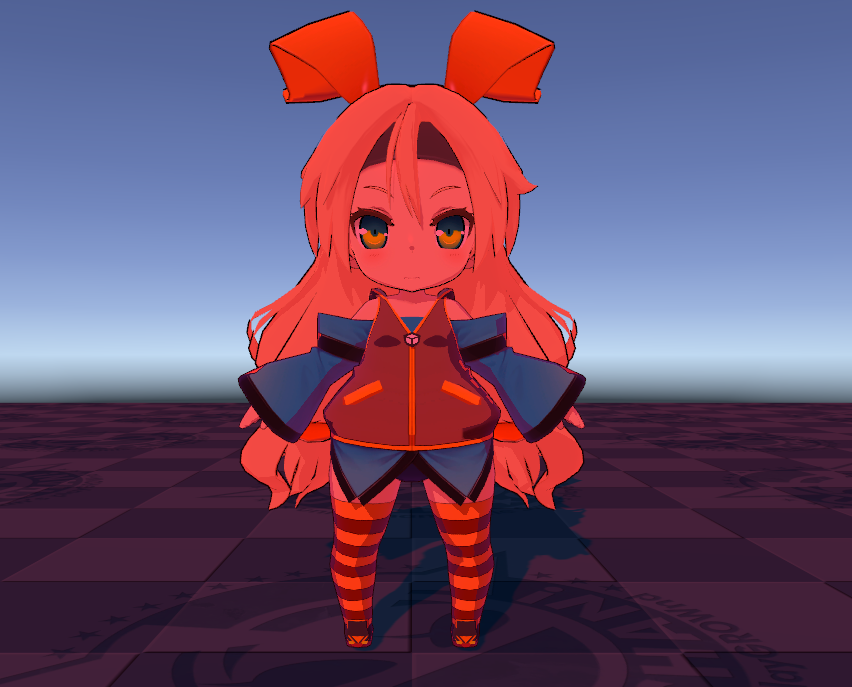
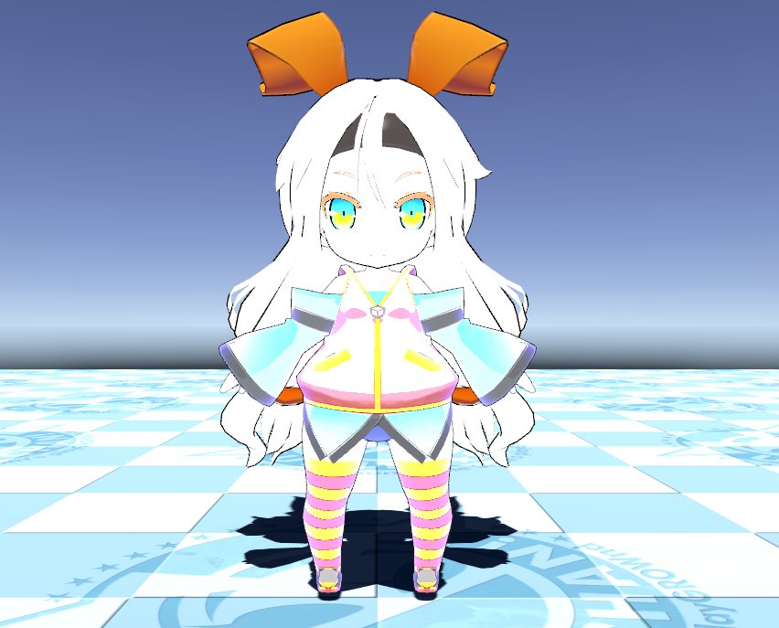
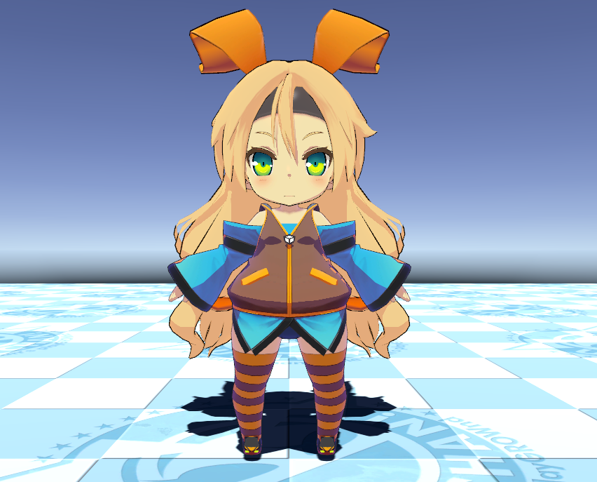

# Scene Light Effectiveness Settings

The **Unity Toon Shader** provides a way to control the effectiveness of lights in the scene per material. There are times when you want to eliminate or limit the effect of lighting on a material type.
UTS allows you to control each area color regardless of the actual light color. While this feature is fundamental to professional cel-shading, sometimes it's necessary to apply actual light colors.
UTS provides a way to determine whether the actual light color affects the material or not.

* [Light Color Effectiveness Settings](#light-color-effectiveness)
* [Light Probe Intensity](#light-probe-intensity)
* [Limit Light Intensity](#limit-light-intensity)

  

## Light Color Effectiveness

If the setting for each color is off, the color is always illuminated with a light intensity of 1 and a light color of white regardless of the intensity of the lights in the scene.

| Property | Description |
| --|  --|
| Base Color |  Light color effect in the base color areas. |
| 1st Shading Color |  Light color effect in the 1st shading color areas. |
| 2nd Shading Color |  Light color effect in the 2nd shading color areas. |
| Highlight |  Light color effect in high lit areas. |
| Rim Light |  Light color effect in rim lit areas. |
| Inverted Light Direction Rim Light | Light color effect in inverted direction rim lit areas. |
| Angel Ring |  Light color effect in angel ring areas. Angel Ring is exclusive to **With Additional Control Maps** mode.|
| MatCap |  Light color effect in  MatCap areas. |
| Outline |  Light color effect in outlines. |

Light Color Effectiveness example: A red light on the face. Unchecked areas on the face material are not affected by the light color.

<canvas class="image-comparison" role="img" aria-label="A Chibi-style character model. The face of the model is unaffected by red light. Then the same model, with Light Color Effectiveness enabled. The face of the model is bright red.">
    
    
</canvas>
 Drag the slider to compare the images.

## Light Probe Intensity

Adds the light probe color to the material color according to the **Light Probe Intensity** value.

## Limit Light Intensity

Limit the brightness of the light to 1 to avoid white-out.

Example: When a intensive directional light is on the character.

<canvas class="image-comparison" role="img" aria-label="A chibi-style character model. Limit Light Intensity is disabled. The model is brightly lit by a white light that washes out the colors. Then the same model, with Limit Light Intensity enabled. The model is lit less brightly and more naturally.">
    
    
</canvas>
 Drag the slider to compare the images.
