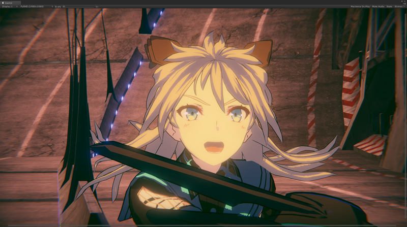
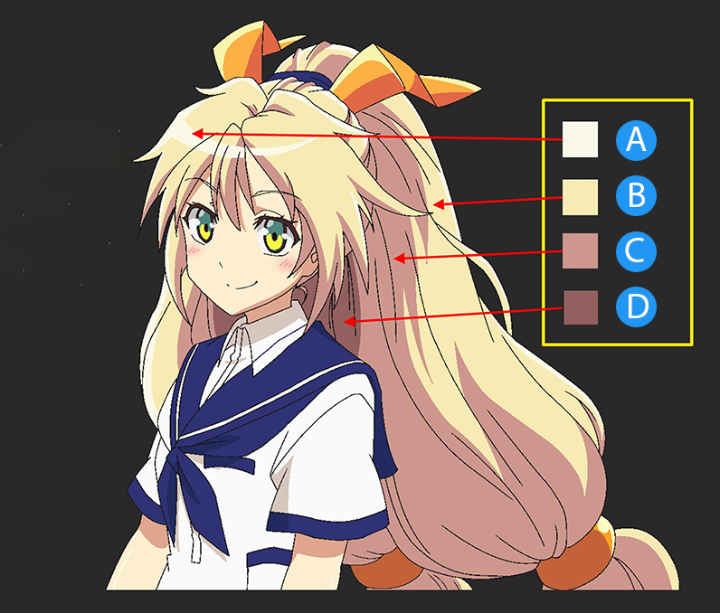

# Unity Toon Shader overview

The **Unity Toon Shader** (UTS3) is a set of toon shaders designed to meet the needs of creators working on cel-shaded 3D-CG animations.

The **Unity Toon Shader** is compatible with all render pipelines: the **Built-in Render Pipeline**, the **Universal Render Pipeline (URP)**, and the **High Definition Render Pipeline (HDRP)**. However, there are some differences in the features supported by different render pipelines. Please refer to [Feature Difference](FeatureModel_en.md) for details about each render pipeline.

**Unity Toon Shader** is the successor to **Unity-chan Toon Shader ver 2.0 (UTS2)**, which was popular for years in games and animations. However, UTS2 was designed solely for the **Built-in Render Pipeline**, consisted of many different shaders, could not be installed through the [Package Manager window](https://docs.unity3d.com/Manual/upm-ui.html), and had a different license from other Unity software.

## Features of Unity Toon Shader

In animation production, color specialists specify detailed color designs for every scene. UTS can apply these color specifications as written in the design instructions. UTS allows users to apply specific colors for light and shadow areas regardless of the actual light colors in the scene. This feature is essential for cel-shaded character designs. UTS provides detailed control over whether the directional light color affects materials.

Typical color design instruction example:

- A: Highlight Color
- B: Base Color
- C: 1st Shading Color
- D: 2nd Shading Color

Three basic colors—**base color**, **1st shading color**, and **2nd shading color**—play key roles in character design with the **Unity Toon Shader**. Please refer to [Three Color Map and Control Map Settings](Basic.md) for more information.

Besides the three basic colors, the **Unity Toon Shader** provides a wide variety of features such as [Highlight](Highlight.md), [Rim Light](Rimlight.md), [Emission](Emission.md), [Angel Ring](AngelRing.md), [Material Capture (MatCap)](MatCap.md), and some special maps.

To get started with cel-shading, see [Getting Started](GettingStarted.md).

## Render Pipeline Compatibility
The **Unity Toon Shader** works across the **Built-in Render Pipeline**,
**Universal Render Pipeline (URP)**, and **High Definition Render Pipeline (HDRP)**.

Feature availability can vary slightly between pipelines,
so review the [feature differences](FeatureModel_en.md) document to confirm
which features are supported in your target pipeline.

> The use of linear color space is strongly recommended.

