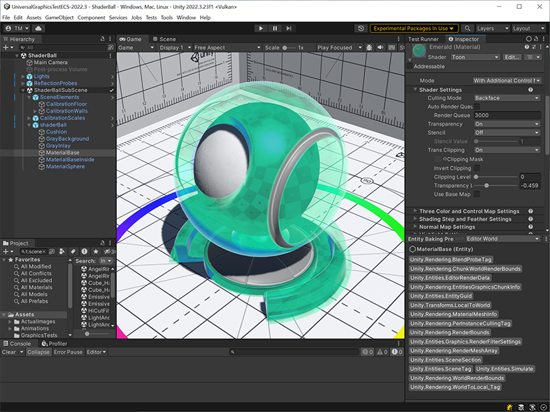

# What's new for Unity Toon Shader 0.10.x-preview

## Compatibity with URP DOTS instancing 

* From 0.10.0-preview on, The **Unity Toon Shader** is compatible with URP DOTS instancing. To use this feature, you need to use 2022.3 or later.
* The minimum Unity version has also changed. Please refer to [Requirements](System-Requirements.md) in the documents.

